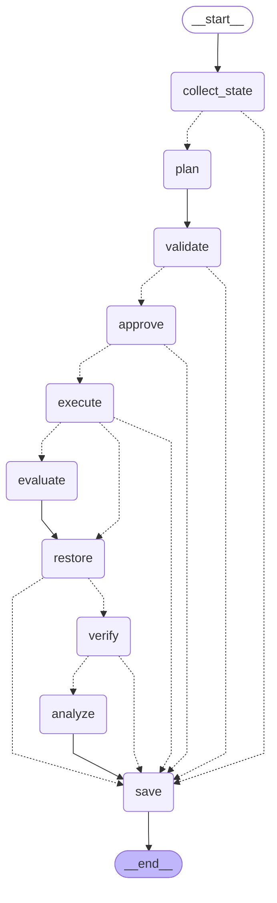

# LangGraph workflow

Generated by `python chaos\cli.py graph`.

```mermaid
---
config:
  flowchart:
    curve: linear
---
graph TD;
	__start__([<p>__start__</p>]):::first
	collect_state(collect_state)
	plan(plan)
	validate(validate)
	approve(approve)
	execute(execute)
	evaluate(evaluate)
	restore(restore)
	verify(verify)
	analyze(analyze)
	save(save)
	__end__([<p>__end__</p>]):::last
	__start__ --> collect_state;
	analyze --> save;
	approve -.-> execute;
	approve -.-> save;
	collect_state -.-> plan;
	collect_state -.-> save;
	evaluate --> restore;
	execute -.-> evaluate;
	execute -.-> restore;
	execute -.-> save;
	plan --> validate;
	restore -.-> save;
	restore -.-> verify;
	validate -.-> approve;
	validate -.-> save;
	verify -.-> analyze;
	verify -.-> save;
	save --> __end__;
	classDef default fill:#f2f0ff,line-height:1.2
	classDef first fill-opacity:0
	classDef last fill:#bfb6fc

```
